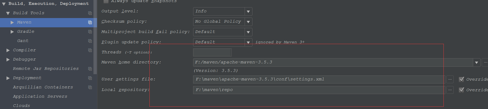

##本地的Maven配置阿里云的中央仓库

###在maven 的配置文件setting.xml中添加一下代码

```xml
<settings xmlns="http://maven.apache.org/SETTINGS/1.0.0"
                xmlns:xsi="http://www.w3.org/2001/XMLSchema-instance"
                xsi:schemaLocation="http://maven.apache.org/SETTINGS/1.0.0 http://maven.apache.org/xsd/settings-1.0.0.xsd">
      
      <!--
        阿里云的中央仓库
      -->
      	<mirrors>
      		<mirror>
      		  <id>alimaven</id>
      		  <name>aliyun maven</name>
      	  　　<url>http://maven.aliyun.com/nexus/content/groups/public/</url>
      		  <mirrorOf>central</mirrorOf>        
      		</mirror>
      	</mirrors>
      	
</settings>

```

   
   
  
   


